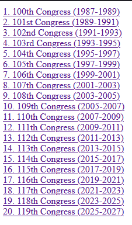

# Sessions_of_Congress-1987-2025
## Introduction

For my Spring 2025 semester course, Web Design and Implementation (ICS 225), the final project required
creating a 20-page HTML website with the help of CSS for styling and layout, with the choice of the topic being up to us. 
I developed a 20-page HTML website titled "The History of the U.S. Congress (1987-Present)", which explores key legislative 
sessions, political shifts, and major events in recent congressional history. The project demonstrates my ability to
design, structure, and style a multi-page website using fundamental web development technologies.

## Relevance and Skill Development

This project strengthened my understanding of how to present complex historical and institutional
information in a clear, accessible, and structured format. Through research, organization, and careful design,
I gained experience in transforming factual data into an engaging digital resource. It also helped refine my
attention to detail, analytical thinking, and ability to communicate information accurately - skills that are
essential in roles requiring precision, documentation, and public engagement.

## Project parameters

According to the rules of this project, we had to create a website with 20 pages, written using HTML and CSS. We also had to 
include the screenshots of at least 8 of those 20 pages. Each page needed to demonstrate
consistent layout design, proper navigation links, semantic HTML structure, and visual styling through CSS.
Additionally, the project was required to feature clear organization, external and internal links, multimedia
integration (such as images or embedded content), and a well-formatted reference page. The overall goal
was to apply the principles of web accessibility, usability, and coherent visual design in a cohesive website
experience.

## Website structure
The website is organized into 20 interconnected HTML pages, each focusing on a specific period, topic, or theme related to 
the history of the U.S. Congress from 1987 to the present. The structure was designed to ensure intuitive navigation and 
logical progression through the content.

### Index 
Gives list of US Congressional sessions from 1987 till 2025, and the link to each webpage representing each session.

### Typical Page Layout
Each webpage within the project follows a consistent structure designed to balance historical content with
visual representation of congressional data. The layout emphasizes readability, organization, and
accessibility across all 20 pages.

- Introductory Text: Each page begins with a short summary describing the specific U.S. Congressional
  session, including its term dates and relevant presidential administration.
- Section Headings: Subheadings such as Senate Composition and House of Representatives Composition
  divide the content into clear segments.
- Graphical Representation: Below each heading, a visual grid illustrates the partisan composition of each
  chamber. Colored squares represent seats held by each party:
  - Blue: Democrats
  - Red: Republicans
  - Gray: Independents
  - (Pink was reserved for empty seats, when applicable)
  - Legends and Labels: A color key appears in the upper-right corner for clarity and reference.
  - Text Summaries: Each chamber's section includes numerical data and contextual explanation of party
    control, leadership, and presiding officers.
  - Consistent Styling: All elements use a shared CSS stylesheet that controls color scheme, alignment, and
    typography, ensuring uniform presentation across sessions.

This standardized format allowed users to compare congressional terms visually and textually, making it
easier to observe shifts in party balance and political trends over time.

### Design and Styling
The website's design combines static structure (HTML) and dynamic visualization (CSS and JavaScript) to
present congressional composition data in a clean and organized format. The styling emphasizes clarity.
accuracy, and consistency across all 20 pages.

- Layout and Structure:
Each page uses a grid-based layout created with CSS Grid, ensuring that visual data (such as Senate and
House seat compositions) aligns evenly in rows and columns. The "div" individual seats are contained within
columns ) to define layout precision.
- Typography and Readability:
The text uses standard system fonts to maintain legibility across browsers. Hierarchical tags like "h3"
and "p" create a clear separation between headings and explanatory content, improving readability
and accessibility.
- Dynamic Visualization:
JavaScript was used to generate the grid of colored squares dynamically. Loops populate the containers
with "div" elements based on the number of seats per party, ensuring accurate representation for each
congressional term. This approach also reduced repetitive manual coding and maintained data accuracy.
- Accessibility and Consistency:
CSS was kept simple and semantic HTML was prioritized, ensuring all content remained accessible and
structured logically. The absolute positioning of the color key provided consistent placement across all
pages, while shared CSS files maintained visual uniformity.

Overall, the minimalist visual approach allows users to focus on the data and historical narrative rather than
decorative elements. The combination of HTML, CSS, and JavaScript demonstrates practical application of
front-end principles, emphasizing precision, usability, and information clarity.

